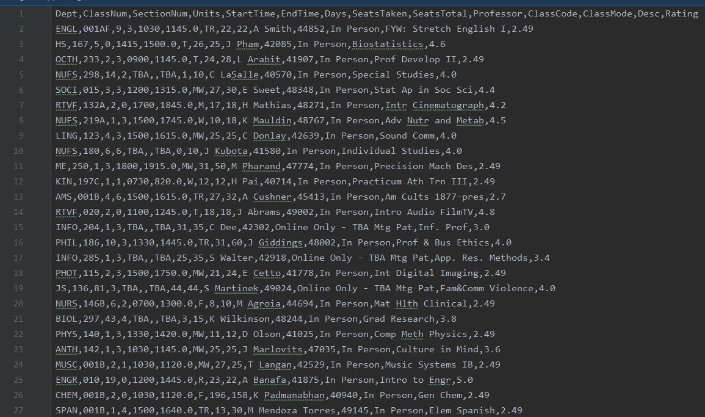
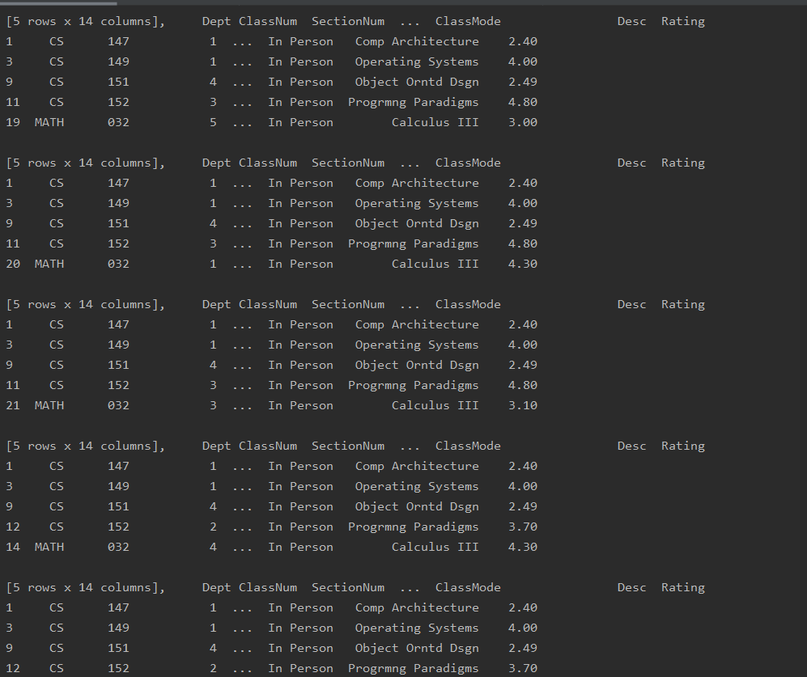
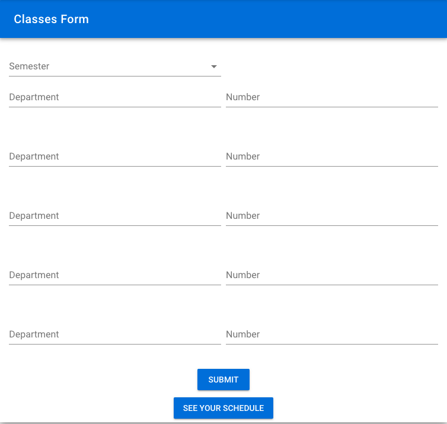
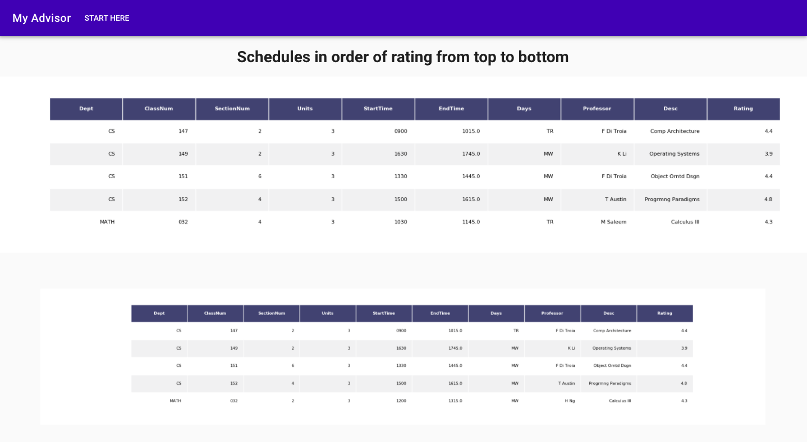

# mySJSUAdvisor
Project to collect data on the course catalog of the current SJSU semester and generate schedules for the user based on given presets.
Data is collected from the SJSU catalog and RateMyProfessor.

Example of consolidated data:

Schedules are generated from the data and given arguments to generate all iterations of viable schedules:

Afterword, schedules are ranked based on their weighted closeness and professor scores then displayed to the user in the frontend. In the future, addition of other factors can easily be implemented:

